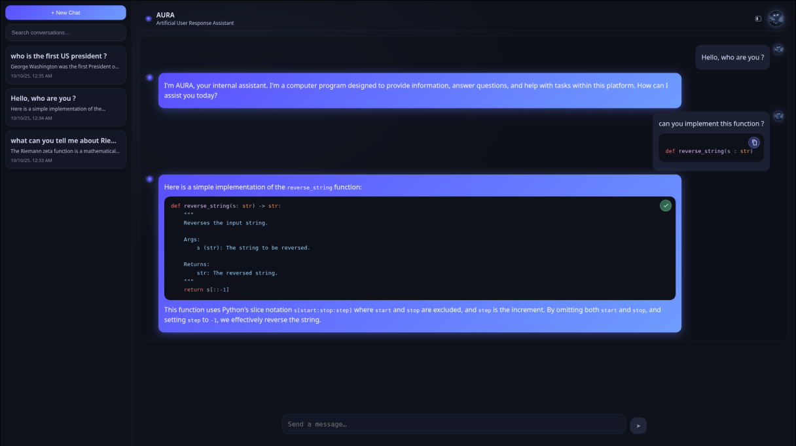

# AURA – Artificial User Response Assistant - your local IA

AURA is a **fully local** AI assistant:

* **Inference** runs on your machine via **[Ollama](https://ollama.com/)** (no cloud).
* **Backend**: Java 21 + Spring Boot.
* **Frontend**: Angular (standalone components, dark UI).
* **Storage**: PostgreSQL (sessions & messages).

---

## 1) Prerequisites

Install the following:

* **Java 21** (Temurin or similar)
* **Maven 3.9+**
* **Node.js 20+** and **npm 10+**
* **Angular CLI** (optional but recommended):

  ```bash
  npm i -g @angular/cli
  ```
* **PostgreSQL 15+**
* **Ollama** (latest) – [https://ollama.com](https://ollama.com)

Recommended local DB setup (matches default config):

* DB name: `aura_db`
* User: `aura`
* Password: `aura_pwd`

---

## 2) Project structure (high level)

```
AURA/
├─ aura-backend/           # Spring Boot app
├─ aura-frontend/          # Angular app
├─ run_local.sh            # one-shot local launcher (Ollama + back + front)
├─ process_killer.sh       # stops processes started by run_local.sh
└─ docker/ …               # (optional, unused now)
```

---

## 3) Configuration

### Backend

* Default port: **`http://localhost:8080`**
* DB: set in `application.yaml` (already configured for local `aura_db` / `aura` / `aura_pwd`)
* Ollama config (already set):

    * `ollama.base-url: http://localhost:11434`
    * `ollama.model: llama3.2`

### Frontend

* Default port (dev server): **`http://localhost:4200`**
* API base URL in Angular env: **`http://localhost:8080`**

---

## 4) Running everything manually

### 4.1 Start Ollama (server + model)

```bash
# Start the Ollama server (in a separate terminal)
ollama serve

# In another terminal: pull the model (first time only)
ollama pull llama3.2

# Quick sanity check
curl -s http://localhost:11434/api/tags | jq
ollama run llama3.2 "Hello"
```

### 4.2 Start the backend

```bash
cd aura-backend
mvn clean spring-boot:run
```

### 4.3 Start the frontend

```bash
cd aura-frontend
npm ci
npm start -- --port 4200
# open http://localhost:4200
```

---

## 5) One-command local launcher (recommended)

Use the provided scripts in the project root:

### Start everything

```bash
chmod +x run_local.sh
./run_local.sh
```

What it does:

1. Checks Ollama server; starts it if needed.
2. Ensures the model (**llama3.2** by default) is present; pulls it if missing.
3. Warms the model in memory.
4. Runs backend via `mvn clean spring-boot:run`.
5. Runs frontend via `npm start` on port **4200**.

**Environment variables (optional):**

```bash
MODEL=llama3.2 \
OLLAMA_URL=http://localhost:11434 \
BACKEND_DIR=aura-backend \
FRONTEND_DIR=aura-frontend \
FRONTEND_PORT=4200 \
LOG_DIR=run-logs \
./run_local.sh
```

### Stop everything started by the script

```bash
chmod +x process_killer.sh
./process_killer.sh
```

---

## 6) Useful API endpoints (manual testing)

Create/continue a chat:

```bash
curl -s -X POST http://localhost:8080/api/chat \
  -H 'Content-Type: application/json' \
  -d '{"sessionId":null,"message":"Introduce yourself in one sentence."}' | jq
```

Fetch messages of a session:

```bash
curl -s "http://localhost:8080/api/sessions/{id}/messages" | jq
```

List sessions (if implemented in your build):

```bash
curl -s "http://localhost:8080/api/sessions?q=&page=0&size=30" | jq
```

---

## 7) Troubleshooting

* **Ollama not reachable**
  Ensure `ollama serve` is running and `curl http://localhost:11434/api/tags` returns a JSON list.

* **Model missing**
  Run `ollama pull llama3.2`. The first download is large (~2GB).

* **Backend can’t connect to DB**
  Check your local Postgres:

  ```bash
  psql -h localhost -U aura -d aura_db -c '\dt'
  ```

  Adjust Spring datasource in `application.yaml` if necessary.

* **Frontend can’t reach API (CORS or 404)**
  Confirm backend runs on `http://localhost:8080` and the Angular env points to that URL.

* **Port collisions**
  Change ports as needed:

    * Backend: `server.port` in Spring or run with `-Dserver.port=8081`
    * Frontend: `npm start -- --port 4201`
    * Ollama: `OLLAMA_HOST=127.0.0.1:11435 ollama serve` (and update `ollama.base-url`)

---

## 🖼️ Screenshots




## 👨‍💻 Author

Developed by **DRK** | [GitHub](https://github.com/DRKdesuga)
